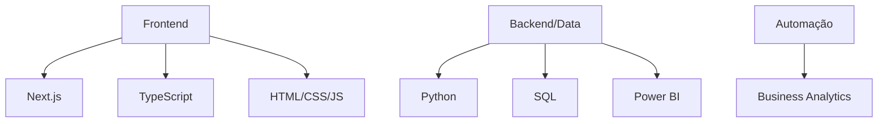

# 👋 Olá, eu sou Paulo Allan

**Estudante de Gestão em Tecnologia pela Estácio** | **Técnico em Informática pelo SENAC RJ (100% concluído)**

Sou apaixonado por **dados, automação e desenvolvimento web**, transformando informações em soluções práticas e visuais. Atualmente me desenvolvendo em **Python, SQL, Power BI** e **Business Analytics**, com diferencial em **Next.js + TypeScript** para criar dashboards e projetos de controle completos.

**Meu foco?** Criar sistemas que mostram **desempenho claro** através de gráficos e métricas, trazendo soluções reais para os negócios. Amo **games** e **treinamento físico** - acredito que **foco + consistência** são a chave para o desenvolvimento pessoal e profissional!

## ⚙️ Stack & Tecnologias

  
  
  
  
  
  
  
  

## 💼 O que eu entrego

- **🚀 Dashboards interativos** (Power BI + Next.js) com métricas em tempo real
- **📊 Projetos de controle** - acompanhamento de desempenho visual
- **🔧 Automação de processos** com Python + SQL
- **🌐 Aplicações web modernas** (Next.js + TypeScript)
- **📈 Análise de dados** transformando números em decisões

## 🔥 Projetos em Destaque

| Projeto | Tecnologias | Resultado |
|---------|-------------|-----------|
| **Dashboard de Performance** | Next.js, TypeScript, Power BI | Visualização completa de KPIs |
| **Sistema de Controle** | Python, SQL, React | Monitoramento automatizado |
| **Analytics Operacional** | Power BI, Python | Insights para decisões estratégicas |

## 📊 GitHub Stats

  
  

## 📫 Me encontre em

  
  
  

---

**💡 "Foco + Consistência = Resultados"**  
*Games, treino e código - minha fórmula para evoluir todos os dias! 🎮💪*
